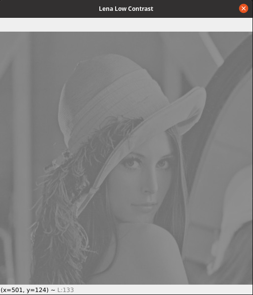

### Görüntü İşleme: Histogram Equalization ile Kontrast Artırımı
Bu yazıda sizlere görüntü işlemede histogram equalization yöntemi ile kontrast artırımı yapılarak resmin görünüm olarak iyileştirilmesini uygulamasıyla birlikte anlatacağım.

Öncelikle görüntü işlemede kontrast ne anlama gelir diyorsanız size şöyle açıklayabilirim. Sisli bir gün ve güneşli bir günde dışarıya baktığınızı düşünün. Sisli gündeki görünüm düşük kontrastlı bir görünüm iken güneşli gündeki görünüm yüksek kontrast değerine sahiptir. Düşük kontrastlı resimlerde detayları farketmek daha güçtür.

Şimdi ise histogramın ne olduğunu anlatmayaya çalışayım. Siyah beyaz (grayscale) bir resmi ele alalım. 0 ve 255 arasında renk yoğunluğu değerleri alıyor. Mesala 100 yoğunluk değerinin kaç farklı pikselde geçtiği histogramda yer alır. Histogram her bir piksel yoğunluk değerinin kaç farklı pikselde geçtiğini gösteren grafiktir. Aşağıdaki grafikte normal kontrast ve düşük kontrast olan iki resmin histogramını veriyorum.


Soldaki histogram normal bir resme ait pikseller bir çok yoğunluk değerine dağılmış durumda. Sağdaki düşük kontrastlı resmin histogramında ise yaklaşık olarak pikseller 110 ve 140 değerleri arasında kalmış durumda. Piksellerin ilk histogramda daha geniş bir dağılım göstermesi resmin daha detaylı bir görünümde olmasını sağlıyor. Sağdaki histograma ait resim ise daha dar bir alanda yayılım sağladığı için soldakine kıyasla detayları farketmesi güç bir resim.

Kontrastı düşük bir resimde kontrast artırmaya ve onu daha anlaşılır kılmaya yarayan yöntemimiz histogram equalization. Formülü ise şöyle:


Bizi ilgilendiren alttaki formül, üstteki formülü ise altta yerine koyulması üzerine verdim. Formülde (L-1) değerimiz en yüksek yoğunluk değerini belirtiyor yani bizim için 255. k değeri ise piksel renk yoğunluğunu ifade ediyor. s değeri formülümüzün çıktısı yani kontrastın artırılmış hali.

Üstte verdiğim formülde M ve N değerleri resmin satır ve kolon sayısını ifade ediyor. n değeri ise k yoğunluğundaki pikselden resimde kaç tane bulunduğunu gösteriyor.

Formülümüzü python programlama dilinde aşağıdaki gibi gerçekledim ve yorum satırlarıyla anlatmaya çalıştım. Bununla birlikte aşağıdaki kodun altında ise OpenCV kütüphanesiyle histogram equalization yapan bir kod var yani üstteki koda ihtiyacınız yok ancak ben formülün algoritmaya nasıl aktarılabileceğini göstermek üzere kodladım. Kodum OpenCV deki koda kıyasla daha yavaş çalışıyor bu yüzden yüzdelik şekilde programın işlemi gerçekleştirme hızını gösteren print fonksiyonları ekledim.

Formülün nasıl gerçeklendiğini gösteren kod:
```py
import numpy as np
import cv2

lena_low_contrast = cv2.imread('lena-low-contrast.jpeg', cv2.IMREAD_GRAYSCALE)
cv2.imshow('lena low contrast', lena_low_contrast)

# k indisine sahip n değeri
def number_of_intensities(intensity):
    """
    Resimdeki bir yoğunluk değerinin 
    resimde kaç pikselde olduğunu
    döndüren fonksiyon
    """
    number_of_intensity = 0
    for i in range(0, lena_low_contrast.shape[0]):
        for j in range(0, lena_low_contrast.shape[1]):
            if lena_low_contrast[i, j] == intensity:
                number_of_intensity += 1
    return number_of_intensity

def total_pixels_in_the_image(image):
    """
    Resmin içindeki toplam piksel
    sayısını döndüren fonksiyon
    """
    height, width = image.shape
    return width * height

# Çıktı olarak kullanacağımız resim
result_image = np.zeros(lena_low_contrast.shape, dtype=np.uint8)


number_of_intensities_dict = {}
def summation(image, indice):
    """
    Formülümüzdeki toplam sembolünün
    hesabını yapan fonksiyon
    """

    sum = 0

    # Resimdeki toplam piksel sayısı
    total_pixels = total_pixels_in_the_image(image)
    for i in range(0, indice):
        """
        Toplam sembolünü ifadesinin tamamlanması 
        aşamasını gösteren yüzdelik ifade
        """
        if indice == 255:
            print('First Step: %' + str(int((i / 255) * 100)))

        """
        Bu if döngüsü resimdeki pikselin yoğunluk 
        miktarının resimde bulunma sayısı eğer
        elimizde mevcutsa hesaplamak yerine
        dictionary yapımız üzerinden alıyor
        """
        if i in number_of_intensities_dict:
            if (number_of_intensities_dict.get(i) <= 0):
                continue
            sum += number_of_intensities_dict.get(i) / total_pixels
        else:
            intensities = number_of_intensities(i)
            number_of_intensities_dict[i] = intensities
            sum += intensities / total_pixels_in_the_image(image)
    return sum

def create_result_image(input_image):
    """
    Bu fonksiyon ilk olarak toplam ifadesi
    fonksiyonunu çağırarak 0 dan 255 e 
    kadar hesaplayıp dictionary üzerine
    atayarak performans artırımı sağlıyor
    Ardından en büyük intensity değeri
    olan 255 ile elde ettiğimiz toplam
    değerini for döngüsü içerisinde
    çarparak sonuç resmimizi oluşturuyor
    """
    summation(result_image, 255)
    for i in range(0, input_image.shape[0]):
        # İkinci ve son aşamanın tamamlanmasını gösteren yüzdelik ifade
        print('Second Step: %' + str(int((i / 512) * 100)))

        for j in range(0, input_image.shape[1]):
            result_image[i, j] = 255 * summation(result_image, lena_low_contrast[i, j])


create_result_image(lena_low_contrast)
cv2.imshow('result image', result_image)
cv2.waitKey(0)
```

OpenCV üzerinde uygulanması:
```py
import cv2
import numpy as np

lena_low_contrast = cv2.imread('lena-low-contrast.jpeg', cv2.IMREAD_GRAYSCALE)
cv2.imshow('Lena Low Contrast', lena_low_contrast)

lena = cv2.equalizeHist(lena_low_contrast)
cv2.imshow('Lena', lena)

cv2.waitKey(0)
```

Düşük kontrast değerine sahip girdi resmimiz:
<br/><br/>

<br/><br/>
Histogram equalization sonrası çıktı resmimiz:
<br/><br/>

<br/><br/>
Yazımız burda bitiyor. İyi çalışmalar.
