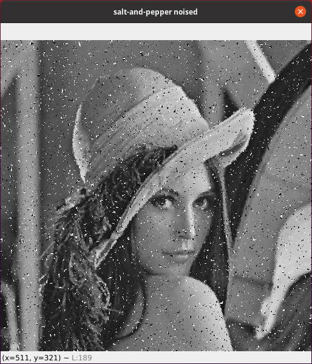
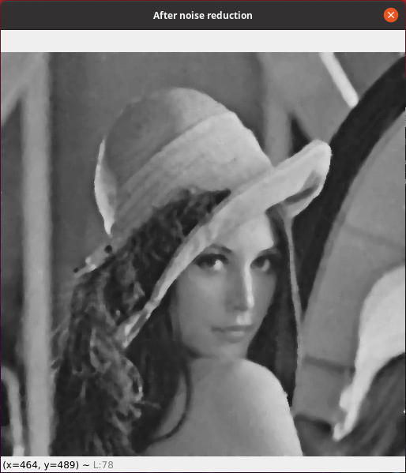

### Görüntü İşleme: Median Filter ile Noise Reduction

Bu yazıda median filter kullanarak noise diye tabir edilen görüntü bozukluğunu gidermeyi anlatacağım.

Öncelikle noise denilen şeyin ne olduğundan bahsetmek istiyorum. Noise dilimize gürültü veya parazit olarak çevrilmiştir ve bir kaç farklı sebepten ötürü resimde noise oluşabilir.

Bu sebeplerden biri image sensor adı verilen resmi algılamak ve iletmek amacıyla kameralarda ve diğer görüntüleme cihazlarında kullanılan algılayıcılardır.

Görüntüde noise oluşmasının başka sebepleri ise şunlar olabilir:

Ağ üzerinde resmin iletilmesi sırasında oluşabilecek kayıplar ve hatalar, resim verisinin sıkıştırılması esnasında oluşabilecek kayıplar olarak özetleyebiliriz.

Bu yazıda noise çeşitlerinden “salt and pepper noise” diğer adıyla “impulsive noise” olarak ifade edilen görüntü bozukluğunu resimden gidermeyi anlatacağım. Salt and pepper noise resimde karanlık alanlarda aydınlık, aydınlık alanlarda karanlık piksellerin ortaya çıkmasıdır.

Bu sorunu gidermek için median filtering kullanacağız. Median türkçede orta değer anlamına geliyor. İsminden de anlaşılabileceği üzere median filtering algoritması piksele ait komşu piksellerin ortancasının değerini piksele atamasıyla gerçekleşiyor.

Median filtering yapabilmek için ilk aşama komşu piksellerdeki yoğunluk değerlerinin alınması ve ardından sıralanmasıdır. Sıralama işlemi gerçekleştikden sonra sıralamada orta sırada yer alan yoğunluk değeri piksele atanır.

Şimdi median filtering işlemini OpenCV de nasıl gerçekleyeceğimizi görelim.

```py
import cv2

img = cv2.imread('salt-and-pepper-lena.png', cv2.IMREAD_GRAYSCALE)
cv2.imshow('salt-and-pepper noised', img)

"""
İkinci parametremiz komşuluk
matrisi boyutunun satır ve sütun
değerleridir ve tek sayı olmalıdır
"""
dst = cv2.medianBlur(img, 7)

cv2.imshow('After noise reduction', dst)

cv2.waitKey(0)
```
<br/><br/>
Girdi resmimiz:
<br/><br/>

<br/><br/>
Çıktı Resmimiz:
<br/><br/>

<br/><br/>
Başka bir yazıda yeniden buluşmak dileğiyle, iyi çalışmalar.
