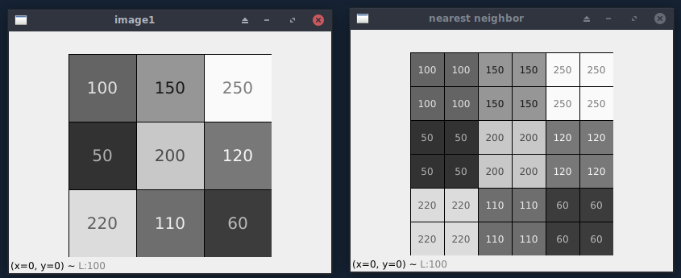
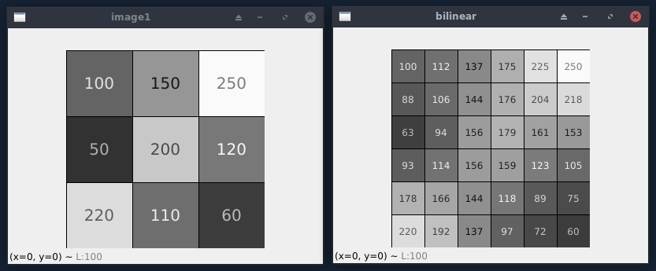
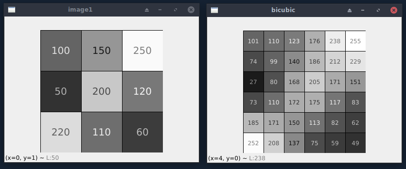

### Görüntü İşleme: Nearest Neighbor Resizing Interpolation<br/>
Bu yazıda sizlere bir resmin daha büyük hale getirilmesi sırasında kullanılan Nearest Neighbor Resizing Interpolation işlemini anlatmaya çalışacağım.<br/><br/>
Elimizde 500x500 pixel değerinde bir resim olduğunu düşünelim. Bunu bir buçuk katına yani 750x750 pixel boyutuna büyültmek istediğimizi varsayalım. Bunu sağlamak üzere uygulayabileceğimiz algoritmalardan 3 tanesinin birincisi Nearest Neighbor Intepolation ve diğer ikisi ise Bilinear Interpolation ve Bicubic Interpolation. Ben bir resmin büyültülmesini sağlayan algoritmalardan en basitini yani Nearest Neighbor Interpolation uygulamasını anlatmaya çalışacağım ve diğer ikisini de birincisiyle birlikte uygulama üzerinde göstereceğim.<br/><br/>
Elimizdeki resmi bir buçuk katına büyültmek üzere algoritmamız şöyle çalışıyor. Resimler bilgisayarda şöyle bir mantıkta tutuluyor f(x, y) şeklinde bir fonksiyonumuz olduğunu düşünelim. x değeri pikselin yatay konumunu belirtirken y değeri ise pikselin dikey konumunu belirtiyor. x ve y her ikisi de 0 veya 0 dan büyük sayılardır.<br/><br/>
Daha basit hale getirerek anlatmak üzere resmimizi grayscale(siyah beyaz tonları) olarak ele alalım. f(x, y) fonksiyonunun sonucu 0 ve 255 değerleri arasında kalan sayısal değerleri veriyor. 0 siyah iken 255 beyaz ve arada kalanlar ise grinin tonları oluyor.<br/><br/>
500x500 boyutundaki resmimizi 750x750 boyutuna büyülttüğümüz zaman f(x, y) fonksiyonunun gösterdiği yeni pixel değerleri boşta kalıyor. Bu piksel değerleri boşta kaldığı için resmin görünümünü bozmadan büyültme işlemi amacıyla Nearest Neighbor algoritması bu boşta kalan pikselleri o pikselin en yakın pikseline ait değeri vererek sağlayabileceği minimum görüntü bozulmasıyla büyültme işlemini gerçekleştiriyor.<br/><br/>
Yazının başında bahsettiğim Bilinear Interpolation ise benzer bir mantıkta çalışıyor ve boşta kalan piksele en yakın komşu 4 piksel değerini göz önünde bulundurarak piksele atama yapıyor. Bu şekilde bir önceki algoritmaya oranla daha kaliteli bir büyültme operasyonu sağlıyor. OpenCV kütüphanesi resize işleminde varsayılan olarak bu algoritmayı tercih ediyor.<br/><br/>
Bicubic Interpolation ise benzer şekilde çalışıyor ve piksele en yakın 16 piksel değerini göz önünde bulundurarak piksele atama yapıyor. Adobe Photoshop ve benzeri ticari uygulamalar Bicubic Interpolation kullanıyor.<br/><br/>
Şimdi bir Python uygulamasında OpenCV ve NumPy kullanarak bu büyültme işlemini gerçekleyeceğim ve çıktısını göstereceğim.<br/><br/>

```py
import numpy as np
import cv2

def interpolate(window_name, interpolation):
    image = np.array([[100, 150, 250],
                      [50, 200, 120],
                      [220, 110, 60]], dtype=np.uint8)

    cv2.namedWindow('image1', cv2.WINDOW_NORMAL)
    cv2.imshow("image1", image)

    print(window_name)
    print('Image 1')
    print(image)

    image = cv2.resize(image, (6, 6), interpolation=interpolation)
    cv2.namedWindow(window_name, cv2.WINDOW_NORMAL)
    cv2.imshow(window_name, image)

    print('Image 2')
    print(image)
    
    cv2.waitKey(0)
    cv2.destroyAllWindows()
    print()

interpolate('nearest neighbor', cv2.INTER_NEAREST)
interpolate('bilinear', cv2.INTER_LINEAR)
interpolate('bicubic', cv2.INTER_CUBIC)
```

Yukarıdaki Python kodları 3x3 boyutundaki resmimize sırasıyla Nearest Neighbor, Bilinear, Bicubic Interpolation algoritmalarını 6x6 boyutuna getirmek üzere uyguluyor. Siz de kendi sisteminizde çalıştırıp herhangi bir tuşa basarak sırasıyla algoritmaların verdiği pencere ve konsol çıktılarını inceleyebilirsiniz. Çıktıları aşağıda sırasıyla veriyorum.<br/><br/>

Nearest Neighbor Interpolation<br/>
<br/><br/>
Bilinear Interpolation<br/>
<br/><br/>
Bicubic Interpolation<br/>
<br/><br/>

Konsol çıktısı:
```
nearest neighbor
Image 1
[[100 150 250]
 [ 50 200 120]
 [220 110 60]]
Image 2
[[100 100 150 150 250 250]
 [100 100 150 150 250 250]
 [ 50 50 200 200 120 120]
 [ 50 50 200 200 120 120]
 [220 220 110 110 60 60]
 [220 220 110 110 60 60]]
 
bilinear
Image 1
[[100 150 250]
 [ 50 200 120]
 [220 110 60]]
Image 2
[[100 112 137 175 225 250]
 [ 88 106 144 176 204 218]
 [ 63 94 156 179 161 153]
 [ 93 114 156 159 123 105]
 [178 166 144 118 89 75]
 [220 192 137 97 72 60]]
 
bicubic
Image 1
[[100 150 250]
 [ 50 200 120]
 [220 110 60]]
Image 2
[[101 110 123 176 238 255]
 [ 74 99 140 186 212 229]
 [ 27 80 168 205 171 151]
 [ 73 110 172 175 117 83]
 [185 171 150 113 82 62]
 [252 208 137 75 59 49]]
 ```
<br/>
Yazımız burda bitiyor. İyi çalışmalar.
